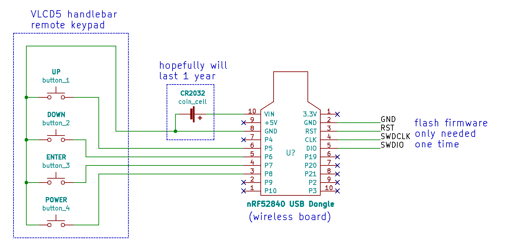

# EBike Handlebar Remote Controller

This project implements a wireless remote button for EBikes and/or GPS units like the Garmin Edge. You can buy on the market a similar product to this remote - see the [Garmin EBike Remote for about 80€](https://buy.garmin.com/en-US/US/p/545795/pn/010-12094-30).
This wireless remote button implements two ANT+ profiles:
1. the ANT+ CTRL profile allowing it to control the page view on compatible bike computers - see the user manual of your device to see if it supports this profile. The remote will pair with any device that supports this profile.
2. The ANT+ LEV (Light Electric Vehicle) profile allowing the remote to control various features of the eBike including  changing the assist level. The remote will work with any eBike that support the ANT+ LEV profile. Of course, the upcoming TSDZ2 wireless eBike controller will support this profile.
see: [wireless EBike TSDZ2](https://github.com/OpenSource-EBike-firmware/TSDZ2_wireless).

For questions, please post on [this forum message](https://endless-sphere.com/forums/viewtopic.php?f=28&t=106346).

See controlling a Garmin 1030 bike computer for assist levels and page control using a simulated ANT+ LEV Ebike in this video:

See changing the ANT+ LEV Device Number (to connect to only one specific eBike) using the Nordic nRF Connect app in this video:

nRFConnect is available on the play store here:
(https://play.google.com/store/apps/details?id=no.nordicsemi.android.mcp&hl=en_CA&gl=US)

## Current state
2020.11.04:
The remote is using the inexpensive VLCD5 handle bar remote keypad for control.
* The firmware works well as an Edge Remote to change page views on the bike computer (tested on Garmin Edge devices).
* The firmware works well as a LEV remote control to change assist levels on an e-bike.
* The remote will go into ultra low power mode if it fails to connect to a device within ~30 seconds, or if no buttons are pressed for 1 hour. The system wakes up from ultra low power when the user presses any button.

* OPERATION:
* Short Press the [MENU] button to switch pages.
* Short press the [PLUS] button to increase the motor assist level
* Short press the [MINUS] button to decrease the motor assist level
* Long press the [PLUS] button to enter bluetooth mode to allow the ANT Device number to be set for the ebike you would like to control. (Device number '0' will pair with any ebike device number)
* Long press the [Minus] button to exit bluetooth mode to save power. (Bluetooth will automatically turn off after:
* 10 minutes if you left bluetooth running
* after you enter a new ANT+ LEV Device Number

* What is left to be done:
  * no battery voltage measurement on the hardware, firmware and so it is not reported to master / Edge
  * Design a suitable spacer for 3D printing that can reuse the VLCD5 keypad and handlebar connector (basically, the top and bottom portions of the keypad)  Inital design attempts are located in the 3d_design folder. Please contribute if you can!
  * Bluetooth enabled bootloader to allow for wireless firmware updates
  * Planned feature: Long press the [POWER] button to turn off the TSDZ2 motor
  * Other ANT+ LEV button assignments (ie: Lights on/off Turn signals, etc)

**Components you will need:**
* [nRF52840 MDK USB Dongle](https://makerdiary.com/products/nrf52840-mdk-usb-dongle): (costs 11€) this is this wireless board
* [CRC2032 button cell](https://en.wikipedia.org/wiki/Button_cell): (costs 1€)
* [VLCD5 handle bar remote keypad](https://www.aliexpress.com/wholesale?catId=0&initiative_id=SB_20200828081711&origin=y&SearchText=LCD+controller+of+VLCD5+display+for+TSDZ2+electric): (costs 6€) can be any keypad that works in the similar way

## Schematic

**Explanation:**
* The CRC2032 button cell powers up the wireless board. Connect the cell positive to the pin 10 / VIN and the negative to the pin 8 / GND.
* VLCD5 handle bar remote keypad has 4 buttons and 5 wires (1 wire for each button and 1 common wire to all buttons). Connect the wires directly to the wireless board.
* For flashing the firmware, that you will need to do only one time, solder the 4 wires to the STLinkV2 (I use a cheap 1€ STLinkV2 clone that I bought on EBay).

## Firmware
Flash the firmware with any tool that works for you. The firmware HEX file to flash is this one: [ebike_wireless_remote_with_sd-v.0.5.hex](firmware/release/ebike_wireless_remote_with_sd-v0.5.hex)

